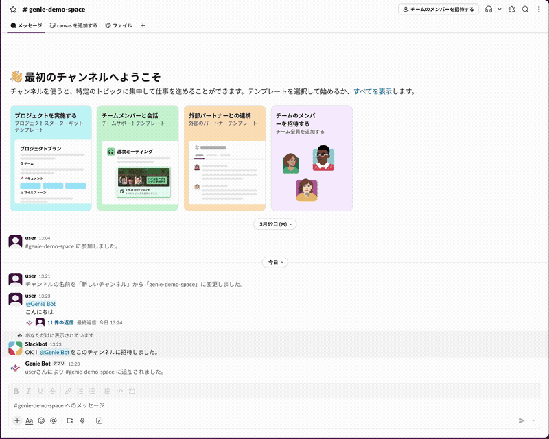

# Genie Slack Bot

Databricks Genie Space に Slack から自然言語で質問できる Bot。
Databricks Apps 上で動作し、Socket Mode で Slack に接続する。

## できること

- **⚡ 即答モード** — Slack から Genie Space に質問。SQL を自動生成・実行し、結果をテーブルとグラフで返す
- **🔬 リサーチモード** — 質問を自動分解し、複数のサブクエリを並列実行。LLM が結果を評価・深堀りし、PDF レポートを生成
- **スレッドで会話継続** — 同じスレッド内でフォローアップ質問が可能（Genie の conversation を維持）
- **LLM 駆動のグラフ自動生成** — Foundation Model API がデータと質問の意図から最適なグラフ種別を判断し、seaborn/matplotlib で描画
- **リアルタイム進捗表示** — リサーチ中は現在の分析内容を Slack にリアルタイム更新
- **フィードバック機能** — Helpful / Not Helpful ボタンで Genie API にフィードバック送信



## アーキテクチャ

```
Slack ──(Socket Mode)──> Databricks App ──(Genie API)──> Genie Space ──(SQL)──> SQL Warehouse
                              │
                              ├── Foundation Model API でグラフ仕様・分析計画・レポートを生成
                              ├── seaborn/matplotlib でグラフ画像生成 → Slack / PDF に埋め込み
                              └── Delta テーブルでリサーチジョブ・ステップ・レポートを永続化
```

| コンポーネント | 役割 |
|---|---|
| Slack Bot (`slack-bolt` AsyncApp) | Socket Mode でメッセージ受信・モード選択・進捗更新・PDF アップロード |
| Databricks App | サービスプリンシパルの OAuth M2M 認証で Genie API を呼び出し |
| Genie Space | 自然言語 → SQL 変換、Unity Catalog テーブルへのクエリ実行 |
| Foundation Model API | 分析計画生成・グラフ仕様決定・結果評価・レポートナラティブ生成 |
| Research Orchestrator | Plan → Parallel Execute → Evaluate → Synthesize パイプライン |
| Delta Tables | ジョブ・ステップ・レポートの状態管理（ハートビート・孤児回復対応） |
| seaborn + japanize-matplotlib | グラフ仕様に基づいて PNG 画像を描画（日本語対応） |
| fpdf2 | Markdown レポート + チャート画像を PDF に変換 |

## ファイル構成

```
genie-slack-bot/
├── databricks.yml                    # DABs メイン設定
├── resources/
│   └── genie_slack_bot.app.yml       # App リソース定義
├── src/app/
│   ├── app.py                        # エントリーポイント（DI wiring）
│   ├── app.yaml.example              # Databricks Apps 設定テンプレート
│   ├── config.py                     # 環境変数の読み込み・バリデーション
│   ├── pyproject.toml                # 依存管理（uv）
│   ├── domain/                       # ビジネスロジック（外部依存なし）
│   │   ├── orchestrator.py           # リサーチパイプライン制御
│   │   ├── column_profiler.py        # カラム統計プロファイリング
│   │   ├── data_enricher.py          # 派生カラム生成
│   │   ├── finding_card.py           # 注意事項（caveat）生成
│   │   ├── report_renderer.py        # Markdown レポートのテーブル挿入
│   │   └── models.py                 # データモデル定義
│   ├── infra/                        # 外部サービス連携
│   │   ├── genie_client.py           # Genie API クライアント
│   │   ├── llm_client.py             # Foundation Model API クライアント
│   │   ├── job_store.py              # Delta ジョブテーブル CRUD
│   │   ├── step_store.py             # Delta ステップ・レポートテーブル CRUD
│   │   └── init_tables.py            # Delta テーブル自動作成
│   └── presentation/                 # Slack UI・グラフ・PDF
│       ├── slack_handler.py          # Slack イベント処理・進捗ポーリング
│       ├── mode_selector.py          # モード選択ボタン Block Kit
│       ├── progress_view.py          # 進捗表示 Block Kit
│       ├── chart_generator_quick.py  # 即答モード用 LLM チャート生成
│       ├── chart_generator.py        # リサーチモード用 LLM チャート生成
│       ├── font_init.py              # 日本語フォント登録（共通）
│       └── pdf_renderer.py           # PDF レポート生成
├── scripts/
│   ├── local_e2e_test.py             # ローカル E2E テスト
│   └── setup_permissions.sh          # SP 権限セットアップスクリプト
├── CLAUDE.md                         # 開発者向けアーキテクチャドキュメント
└── README.md
```

## 前提条件

- Databricks ワークスペース（Apps 機能が有効）
- Databricks CLI がインストール・認証済み
- Slack ワークスペースの管理者権限（Slack App 作成に必要）
- Genie Space と接続先の Unity Catalog テーブルが準備済み

---

## セットアップ手順

### Step 1: Slack App の作成

1. https://api.slack.com/apps を開く
2. **Create New App** → **From scratch** を選択
3. App Name（例: `Genie Bot`）と対象ワークスペースを選択して作成

### Step 2: Socket Mode の有効化

1. 左メニュー **Socket Mode** をクリック
2. **Enable Socket Mode** を ON にする
3. Token Name（例: `genie-socket`）を入力し **Generate** をクリック
4. 表示される `xapp-` で始まるトークンを控える → **SLACK_APP_TOKEN** として使用

### Step 3: Bot のスコープ設定

1. 左メニュー **OAuth & Permissions** をクリック
2. **Scopes** セクションの **Bot Token Scopes** で **Add an OAuth Scope** をクリック
3. 以下の 6 つのスコープを追加:

| スコープ | 用途 |
|---|---|
| `app_mentions:read` | チャンネルでの @メンション検知 |
| `chat:write` | Bot からのメッセージ送信 |
| `files:write` | グラフ画像のアップロード |
| `im:history` | DM の履歴読み取り |
| `im:read` | DM チャンネルの読み取り |
| `im:write` | DM への書き込み |

### Step 4: Event Subscriptions の設定

1. 左メニュー **Event Subscriptions** をクリック
2. **Enable Events** を ON にする
3. **Subscribe to bot events** で以下を追加:

| イベント | 用途 |
|---|---|
| `app_mention` | チャンネルで Bot がメンションされたとき |
| `message.im` | Bot に DM が送られたとき |

### Step 5: ワークスペースへのインストールとトークン取得

1. 左メニュー **OAuth & Permissions** → **Install to Workspace** → **Allow** をクリック
2. 表示される `xoxb-` で始まるトークンを控える → **SLACK_BOT_TOKEN** として使用
3. 左メニュー **Basic Information** → **App Credentials** セクション → **Signing Secret** の **Show** をクリックして控える → **SLACK_SIGNING_SECRET** として使用

### Step 6: Genie Space ID の取得

1. Databricks ワークスペースで対象の Genie Space を開く
2. 右上の **Settings**（歯車アイコン）をクリック
3. 表示される Space ID をコピー → **DATABRICKS_GENIE_SPACE_ID** として使用

### Step 7: app.yaml の作成

```bash
cp src/app/app.yaml.example src/app/app.yaml
```

`src/app/app.yaml` を編集し、Step 2〜6 で取得した値を記入:

```yaml
command: ["uv", "run", "python", "app.py"]

env:
  - name: SLACK_BOT_TOKEN
    value: "xoxb-..."        # Step 5 で取得
  - name: SLACK_SIGNING_SECRET
    value: "..."              # Step 5 で取得
  - name: SLACK_APP_TOKEN
    value: "xapp-..."        # Step 2 で取得
  - name: DATABRICKS_GENIE_SPACE_ID
    value: "..."              # Step 6 で取得
  - name: LOG_LEVEL
    value: "INFO"
  # チャート生成用 LLM（即答・リサーチ共通）
  - name: LLM_CHART_ENDPOINT
    value: "databricks-gpt-5-4-mini"
  # リサーチモード有効化（任意）
  - name: ENABLE_RESEARCH
    value: "true"
  - name: RESEARCH_CATALOG
    value: "<catalog_name>"        # リサーチ用 Delta テーブルの catalog
  - name: LLM_RESEARCH_ENDPOINT
    value: "databricks-gpt-5-4"    # 分析計画・評価用
  - name: LLM_NARRATIVE_ENDPOINT
    value: "databricks-claude-opus-4-6"  # レポートナラティブ用
```

### Step 8: Databricks CLI の認証

```bash
# ワークスペースにログイン（ブラウザで SSO 認証）
databricks auth login --host https://<your-workspace>.cloud.databricks.com --profile DEFAULT

# 認証状態の確認（Valid が YES であること）
databricks auth profiles
```

> `databricks.yml` の `workspace.profile` がログインした profile 名と一致していることを確認してください。デフォルトは `DEFAULT` です。

### Step 9: Databricks Asset Bundle でデプロイ

```bash
# 1. バリデーション
databricks bundle validate

# 2. デプロイ（ファイルアップロード + アプリ作成）
databricks bundle deploy

# 3. app.yaml をワークスペースにアップロード（.gitignore で除外されているため手動）
# source_code_path は databricks bundle validate の出力で確認
databricks workspace import "<source_code_path>/app.yaml" --file src/app/app.yaml --format AUTO --overwrite

# 4. アプリ起動
databricks bundle run genie_slack_bot
```

> **ターゲット指定**: prod 環境にデプロイする場合は `-t prod` を付与

### Step 10: サービスプリンシパルに権限を付与

セットアップスクリプトで自動付与できます:

```bash
./scripts/setup_permissions.sh --profile DEFAULT
```

スクリプトが自動で行うこと:
- アプリの Service Principal Client ID を取得
- Genie Space に CAN_RUN 権限を付与
- SQL Warehouse に CAN_USE 権限を付与
- リサーチ用スキーマの作成と UC 権限付与（CREATE TABLE, CREATE VOLUME）

**残りの手動作業**: Genie Space が参照する UC テーブルへの SELECT 権限:

```sql
GRANT SELECT ON TABLE <catalog>.<schema>.<table> TO `<sp_client_id>`;
```

### Step 11: 動作確認

```bash
databricks apps logs genie-slack-bot-dev
```

以下が出ていれば起動成功:

```
⚡️ Bolt app is running!
Starting to receive messages from a new connection
```

---

## 使い方

| 方法 | 例 |
|---|---|
| **DM** | Bot に直接メッセージ: `売上トップ10の顧客は？` |
| **チャンネル** | `@Genie Bot 地域別の売上推移を見せて` |
| **スレッドで深掘り** | 回答のスレッドに `前四半期と比較して` と続ける |
| **フィードバック** | 回答後に表示される **Helpful** / **Not Helpful** ボタンをクリック |

### リサーチモード（ENABLE_RESEARCH=true 時）

1. Bot に質問を送ると **⚡ 即答** / **🔬 詳しく分析** のモード選択ボタンが表示される
2. **⚡ 即答** → 従来通りの即座回答（テーブル + チャート）
3. **🔬 詳しく分析** → リサーチパイプラインが起動:
   - 質問を「俯瞰→仮説検証→交絡因子統制」のフレームワークで4つのサブクエスチョンに自動分解（並列実行）
   - 進捗がリアルタイムで Slack に表示される
   - LLM が結果を評価し、品質シグナル（外れ値・矛盾・集中・未説明の差）があれば追加の深堀り質問を実行
   - 完了後、PDF レポートがスレッドにアップロードされる
4. リサーチ中に **キャンセル** ボタンで中断可能
5. 単純な質問は4ステップ約3分で完結。複雑な質問（仮説対立の検証等）は最大6ステップ（`MAX_STEPS`）まで自動拡張。`MAX_DURATION`（デフォルト 300 秒）を超えると追加の深堀りとチャート生成をスキップするが、初期並列バッチ・ナラティブ生成・PDF アップロードは完了まで待機するため、全体の所要時間は 5 分を超える場合がある

### グラフの自動生成

LLM（Foundation Model API）がユーザーの質問とクエリ結果を分析し、最適なグラフ種別を自動選択します。

| グラフ種別 | 選択される場面 |
|---|---|
| 縦棒グラフ | ランキング・比較（12カテゴリ以下） |
| 横棒グラフ | ランキング・比較（13カテゴリ以上 or 平均ラベル長16文字超） |
| 折れ線グラフ | 時系列の推移 |
| 複数折れ線 | カテゴリ別の時系列推移 |
| 面グラフ | 累計・ボリュームの推移 |
| ドーナツチャート | シェア・構成比・割合 |
| 積み上げ棒グラフ | カテゴリ別の内訳比較 |
| グループ化棒グラフ | 同スケールの複数指標比較 |
| 散布図 | 2つの数値の相関 |
| ヒストグラム | 数値の分布 |
| 2軸グラフ | スケールが異なる2指標の比較 |

### フィードバック

- **Helpful** ボタン → Genie Space に POSITIVE フィードバックが送信される
- **Not Helpful** ボタン → Genie Space に NEGATIVE フィードバックが送信される

---

## 再デプロイ

ソースコードを変更した場合:

```bash
# ファイルアップロード
databricks bundle deploy

# アプリ再起動（bundle deploy だけでは再起動しない）
databricks apps deploy genie-slack-bot-dev \
  --source-code-path /Workspace/Users/<user>/.bundle/genie-slack-bot/dev/files/src/app
```

---

## トラブルシューティング

| 症状 | 原因と対処 |
|---|---|
| `invalid_auth` エラー | Slack トークンが無効。Slack App の OAuth & Permissions で再インストールし、新しいトークンで `app.yaml` を更新 |
| Genie API timeout | SQL Warehouse が停止中の可能性。Warehouse を起動してから再試行 |
| グラフが表示されない | Slack App に `files:write` スコープが未追加。追加後に Reinstall to Workspace が必要 |
| グラフにタイトル/ラベルがない | japanize-matplotlib が未インストール。`pyproject.toml` に記載されているか確認 |
| `App Not Available` とブラウザに表示 | 正常動作。このアプリはバックエンドサービスのため UI はない |

---

## アクセス制御

Bot を利用できるユーザーを制限する方法は 3 つあります。用途に応じて組み合わせてください。

### 1. チャンネル制限（推奨）

Bot をプライベートチャンネルにのみ招待し、パブリックチャンネルには参加させない方法です。チャンネルのメンバーシップがそのままアクセス制御になります。

1. Slack でプライベートチャンネルを作成（例: `#genie-data-team`）
2. Bot をそのチャンネルに招待: `/invite @Genie Bot`
3. Bot が参加していないチャンネルではメンション・DM しても反応しない

> Bot をパブリックチャンネルに招待しない限り、そのチャンネルのメンバー以外は利用できません。

### 2. Slack App 管理画面でのインストール制限

Slack の管理コンソールから、App 自体のインストールや利用を制限できます。

1. [Slack Admin Console](https://app.slack.com/admin) → 「Apps」
2. 対象の Bot App を選択
3. 「Settings」→「Restrict API Token Access」で、特定のワークスペースまたはチャンネルに制限
4. 「Who can install this app」で管理者のみに制限

> Enterprise Grid の場合は Org レベルの App Management で、どのワークスペースにデプロイするかも制御できます。

### 3. DM（ダイレクトメッセージ）の制限

Bot への DM を特定ユーザーのみに制限する方法です。

1. [Slack Admin Console](https://app.slack.com/admin) → 「Apps」→ 対象 App
2. 「App Home」→ 「Allow users to send Slash commands and messages from the messages tab」をオフにする（DM を無効化）
3. または Enterprise Grid の場合: 「Who can direct message this app」で特定のユーザーグループに制限

> DM を無効にした場合、ユーザーはチャンネルでのメンションでのみ Bot を利用できます。チャンネル制限（方法 1）と組み合わせることで、利用者を二重に制限できます。

### 注意事項

- Bot は **Service Principal の権限**でデータにアクセスします。Bot を利用できるユーザー = SP が見えるデータにアクセスできるユーザーです
- Genie Space に設定するテーブルのスコープが、Bot 利用者全員に公開して問題ないデータであることを確認してください
- リサーチ機能で生成された PDF は Slack スレッドにアップロードされ、チャンネルのメンバー全員が閲覧できます

## 制限事項

- 会話マッピング（スレッド ↔ Genie conversation）はインメモリ管理のため、アプリ再起動で消失する
- Genie API のフィードバックは rating（POSITIVE/NEGATIVE）のみ保存可能。テキストコメントは未サポート
- リサーチモードは最大 6 ステップ。`MAX_DURATION` 超過時は深堀り・チャートをスキップするが、Genie API 応答待ち・ナラティブ生成・PDF は完了まで待機するため全体で 10 分程度かかることがある
- Genie Space のテーブル・カラムが少ない場合、チャートタイプが bar/hbar に偏りやすい（時系列や構成比データがないと line/pie が選択されない）。より多くのテーブル・カラムを持つ Genie Space ほどリサーチモードの分析が多角的になる
- `bundle deploy` はファイルをアップロードするだけでアプリを再起動しない。`databricks apps deploy` が必要

## 参考

- [Databricks Apps Docs](https://docs.databricks.com/aws/en/dev-tools/databricks-apps/)
- [Databricks Apps Dependencies](https://docs.databricks.com/aws/en/dev-tools/databricks-apps/dependencies)
- [Genie API Reference](https://docs.databricks.com/api/workspace/genie)
- [Slack Bolt for Python](https://slack.dev/bolt-python/)
